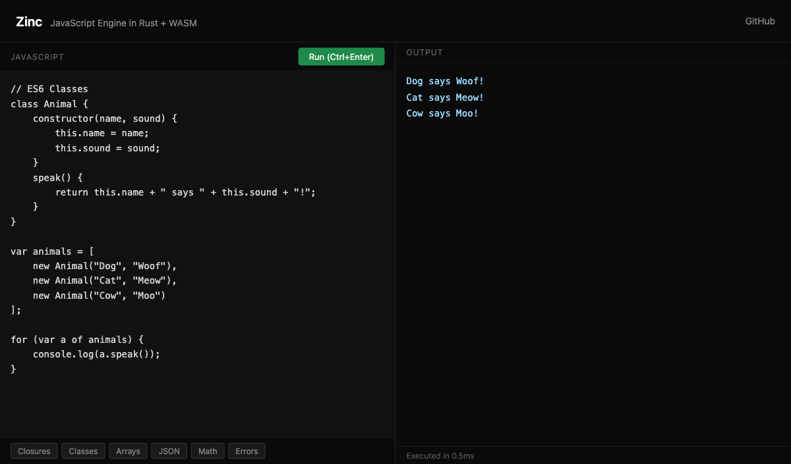

# Zinc

A JavaScript engine written from scratch in Rust with an **experimental ARM64 JIT compiler**.

Zinc implements a complete pipeline from source code to execution: **lexer** → **parser** → **bytecode compiler** → **virtual machine** → **JIT**. Every component is hand-written with zero runtime dependencies on existing JS engines.

**92.3% [Test262](docs/TEST262.md) conformance (9,052 / 9,805 tests)** | **90 tests** | **~22,500 lines of Rust** | **beats V8 on fibonacci, ackermann, and loop_sum**



## What's New in v0.3.0

- **92.3% test262 conformance** — up from 84.3% (9,052 / 9,805 active tests, +3,591 tests passing)
- **Private class fields and methods** (`#field`, `#method()`) — full `#`-prefixed syntax with private instance fields, static fields, private methods, private getters/setters, and Unicode-escaped private names (`#\u{6F}_`)
- **try/finally + break/continue** — `finally` blocks now always execute even when `break` or `continue` exits the `try` body; nested finally blocks inline correctly
- **Generator/async scope isolation** — `yield` and `await` are valid identifiers inside nested non-generator/non-async functions, even when those are inside a generator or async body
- **Future reserved words as identifiers** — `implements`, `interface`, `package`, `private`, `protected`, `public`, `static`, `let` are valid variable names in non-strict mode
- **`undefined` as binding identifier** — `var undefined` and `for (var undefined of ...)` now parse correctly
- **Unicode identifiers** — proper Unicode ID_Start/ID_Continue via the `unicode-id-start` crate (fixes identifiers like `℘`, `ZW_\u200C_NJ`)
- **Regex/division disambiguation** — `/` after `undefined`, `null`, `true`, `false` is now correctly treated as division, not the start of a regex literal
- **Error.prototype.toString()** — error objects now stringify as `"TypeError: message"` instead of `"[object Object]"`
- **AST nodes derive Clone** — all AST types now implement `Clone`, enabling finally-block inlining

## Try It

**In the browser** — no install needed:

```bash
cd web && python3 -m http.server 8080
# Open http://localhost:8080
```

**As a CLI:**

```bash
cargo build --release
cargo run --release -- script.js   # run a file
cargo run --release                # REPL
cargo test                         # run tests
```

## JIT Compiler

Zinc includes an **experimental ARM64 JIT** that emits raw machine code — no Cranelift, no LLVM, just hand-written instruction bytes into `mmap`'d executable memory.

The JIT has two modes:

1. **Pattern matching** — detects recursive functions (fibonacci, Ackermann, tak) and emits hand-tuned ARM64
2. **Bytecode walking** — translates loop-based functions opcode-by-opcode, mapping the VM stack to registers

When a function is called 100+ times, the VM compiles it to native code on the fly:

```
fibonacci(35):  Zinc JIT 20ms  vs  Node.js 70ms   (1.75x faster)
ack(3,9):       Zinc JIT 70ms  vs  Node.js 260ms  (3.7x faster)
loop_sum(1B):   Zinc JIT 440ms vs  Node.js 630ms  (1.4x faster)
```

See [JIT.md](docs/JIT.md) for technical details.

## Features

### Language

| Category | Supported |
|----------|-----------|
| **Data types** | Numbers (int + float), strings, booleans, `null`, `undefined`, `NaN`, `Infinity`, Symbol |
| **Operators** | `+` `-` `*` `/` `%` `**` `<` `<=` `>` `>=` `==` `===` `!=` `!==` `&&` `\|\|` `!` `??` `&` `\|` `^` `~` `<<` `>>` `>>>` `?:` `typeof` `void` `delete` `++` `--` `+=` `-=` `in` `instanceof` etc. |
| **Variables** | `var` (with hoisting), `let`, `const` with block scoping and TDZ, const reassignment prevention |
| **Control flow** | `if`/`else`, `while`, `do-while`, `for`, `for...in`, `for...of`, `switch`/`case`, labeled `break`/`continue` |
| **Functions** | Declarations, expressions, arrow functions, closures, recursion, default params, rest params, `Function.prototype.call`/`apply`/`bind`, `Function.length`, `Function.name` |
| **Classes** | `class`, `constructor`, `extends`, `super()`, instance methods, static methods, getters/setters, private fields (`#field`, `#method()`), `new`, prototype chain inheritance |
| **Objects** | Literals, property get/set, computed properties, getters/setters, `this` binding, prototype chain, spread (`{...obj}`), `Object.keys`/`values`/`entries`/`assign`/`create`/`defineProperty`/`freeze`/`seal`/`is`/`getPrototypeOf`/`setPrototypeOf`/`getOwnPropertyNames`/`getOwnPropertyDescriptor`/`hasOwn` |
| **Arrays** | Literals, indexed access, spread (`[...arr]`), `.length`, `.push`, `.pop`, `.map`, `.filter`, `.reduce`, `.reduceRight`, `.forEach`, `.find`, `.findIndex`, `.findLast`, `.findLastIndex`, `.some`, `.every`, `.join`, `.indexOf`, `.lastIndexOf`, `.includes`, `.reverse`, `.shift`, `.unshift`, `.splice`, `.slice`, `.concat`, `.sort`, `.fill`, `.copyWithin`, `.flat`, `.flatMap`, `.at`, `.keys`, `.values`, `.entries`, `Array.from`, `Array.of`, `Array.isArray` |
| **Strings** | 25+ methods: `.charAt`, `.charCodeAt`, `.codePointAt`, `.indexOf`, `.lastIndexOf`, `.includes`, `.startsWith`, `.endsWith`, `.slice`, `.substring`, `.toUpperCase`, `.toLowerCase`, `.trim`, `.trimStart`, `.trimEnd`, `.split`, `.replace`, `.replaceAll`, `.match`, `.search`, `.repeat`, `.padStart`, `.padEnd`, `.concat`, `.at`, `.toString`, `String.fromCharCode`, `String.fromCodePoint` |
| **Numbers** | `Number.isNaN`, `Number.isFinite`, `Number.isInteger`, `Number.isSafeInteger`, `Number.parseInt`, `Number.parseFloat`, `.toString(radix)`, `.toFixed()`, `.valueOf()` |
| **Regular expressions** | `/pattern/flags` literals, `.test()`, `.exec()`, `.source`, `.flags`, `.global`; regex-aware `.replace()`, `.match()`, `.search()`, `.split()`, `.replaceAll()` |
| **Template literals** | `` `hello ${name}` `` with interpolation and nesting |
| **Destructuring** | `var {a, b} = obj`, `var [x, y] = arr`, rest elements (`...rest`), default values (`x = 5`), nested patterns, assignment expressions (`[a, b] = [1, 2]`), for-of destructuring |
| **Optional chaining** | `obj?.prop`, `obj?.[expr]`, `fn?.()` |
| **Nullish coalescing** | `a ?? b` |
| **Spread** | `[...arr]`, `{...obj}`, `fn(...args)` |
| **Promises** | `new Promise`, `.then`/`.catch`/`.finally`, `Promise.resolve`/`reject`/`all`/`race`/`allSettled`/`any`, microtask queue |
| **Async/await** | `async function`, `await` on promises and values |
| **Generators** | `function*`, `yield`, `.next(val)`, `.return()`, `.throw()`, `for...of` integration |
| **Iterators** | `for...of` with array/string/generator iterator protocol |
| **Collections** | `Map`, `Set`, `WeakMap`, `WeakSet` with full prototype methods |
| **Symbols** | `Symbol()`, `Symbol.iterator`, `Symbol.hasInstance`, `Symbol.toPrimitive`, `Symbol.toStringTag` |
| **Property descriptors** | `writable`, `enumerable`, `configurable` flags, `Object.defineProperty`, `Object.freeze`/`seal` |
| **Error handling** | `try`/`catch`/`finally`, `throw`, `new Error()`, `TypeError`, `RangeError`, `ReferenceError`, `SyntaxError`, `instanceof` with prototype chain, catch destructuring |
| **eval()** | Runtime compilation and execution |
| **ES Modules** | `import { a } from './mod.js'`, `export`, `export default`, `export * from`, module caching |
| **JSON** | `JSON.parse` (full recursive descent), `JSON.stringify` |
| **Math** | `PI`, `E`, `floor`, `ceil`, `round`, `abs`, `sqrt`, `pow`, `max`, `min`, `sin`, `cos`, `tan`, `log`, `random`, etc. |
| **Globals** | `console.log`/`warn`/`error`, `parseInt`, `parseFloat`, `isNaN`, `isFinite`, `eval`, `String`, `Number`, `Boolean`, `Array.isArray`, `Object.*` |

### Engine Internals

- **NaN-boxed values** — every JS value in 8 bytes via IEEE 754 quiet NaN space with sign-bit tagging
- **~130 bytecode opcodes** with variable-length encoding
- **Stack-based VM** with call frames, operand stack, and upvalue-based closures
- **ARM64 JIT** — hand-written machine code emitter with two compilation modes
- **Prototype chain** — real `__proto__` traversal for property lookup and class inheritance
- **Property descriptors** — writable/enumerable/configurable flags on all properties
- **Pratt parser** with precedence climbing across ~25 levels
- **Lua-style upvalues** — open (stack) → closed (heap) for proper closure semantics
- **String interning** — O(1) comparison for all identifiers and property names
- **Mark-and-sweep GC** — automatic garbage collection with root tracing and slot reuse
- **Microtask queue** for Promise resolution
- **Regex caching** — compiled regex patterns cached for reuse
- **WebAssembly build** — runs in the browser via WASM

## Benchmarks

### Interpreter vs Node.js

See [BENCHMARKS.md](docs/BENCHMARKS.md) for details.

```
Benchmark              Zinc       Node       Ratio
────────────────────────────────────────────────────
fibonacci(35)          0.020s     0.070s      0.3x
loop_sum(1B)           0.440s     0.630s      0.7x
closure_counter(100K)  0.030s     0.034s      0.9x
sieve(10K)             0.030s     0.034s      0.9x
object_create(100K)    0.036s     0.034s      1.1x
string_concat(10K)     0.061s     0.033s      1.8x
loop_sum(1M interp)    0.094s     0.036s      2.6x
```

### SunSpider

12 classic [SunSpider](https://webkit.org/perf/sunspider/sunspider.html) benchmarks — see [SUNSPIDER.md](docs/SUNSPIDER.md).

```bash
cargo build --release
bash bench/run_all.sh          # micro benchmarks
bash bench/sunspider/run.sh    # SunSpider benchmarks
```

## Test262 Conformance

**92.3%** of tested ECMAScript spec tests pass (9,052 / 9,805 active tests). See [TEST262.md](docs/TEST262.md).

15 categories with **100% pass rate** including: numeric literals, string literals, boolean literals, compound-assignment, if, return, throw, coalesce, keywords, block, and more.

```bash
git clone --depth 1 https://github.com/nicolo-ribaudo/test262.git
cargo run --release --bin test262_runner
```

## Architecture


### NaN-Boxing

Every JavaScript value fits in a single `u64`:

```
Normal f64:      stored as-is
Tagged values:   SIGN_BIT | QNAN | 3-bit tag | 48-bit payload

Tags: object ptr | int32 (SMI) | boolean | null | undefined | string id | symbol id | function ref
```

The operand stack is `Vec<u64>` — 8 bytes per slot, zero heap allocation per value.

## Project Structure

```
src/
  main.rs              CLI: REPL + file execution
  engine.rs            Orchestrator: lex → parse → compile → run
  lexer/               Tokenizer (cursor, tokens, keywords, ASI)
  parser/              Recursive descent + Pratt expression parser
  ast/                 ~80 AST node types
  compiler/            AST → bytecode compiler + disassembler
  vm/                  Stack-based VM (core, builtins, promises, JSON, call, map, regexp)
  jit/                 ARM64 JIT compiler (assembler, executable memory, compiler)
  runtime/             NaN-boxed values, object heap, property descriptors, builtins
  gc/                  Mark-and-sweep GC foundation
  util/                String interner

tests/                 90 tests (unit + parser + e2e + JIT)
bench/                 Micro benchmarks + SunSpider
tools/                 Test262 conformance runner
web/                   WASM playground (HTML + compiled WASM)
```

## Stats

- **~22,500 lines** of Rust
- **90 tests** passing
- **92.3%** Test262 conformance (9,052 / 9,805 active tests)
- **1.5 MB** WASM binary (includes regex engine)
- **Beats V8** on fibonacci (1.75x), Ackermann (3.7x), and loop_sum (1.4x)
- Zero external dependencies for code generation

## License

MIT
