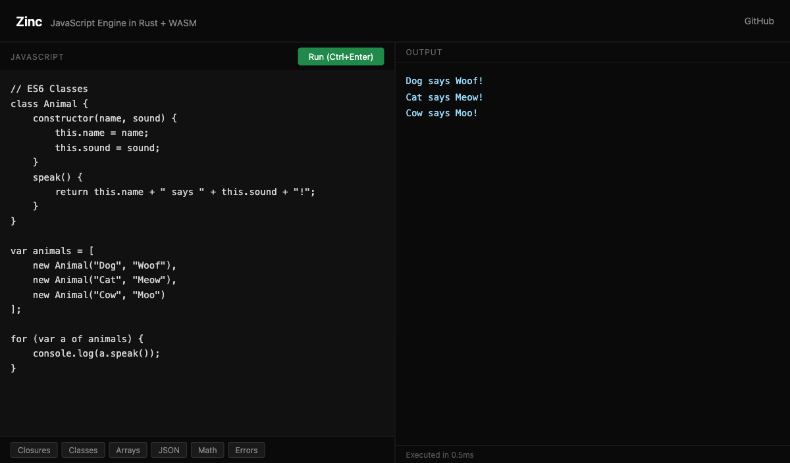

# Zinc

A JavaScript engine written from scratch in Rust with an **experimental JIT compiler** (ARM64 + x86-64).

Zinc implements a complete pipeline from source code to execution: **lexer** → **parser** → **bytecode compiler** → **virtual machine** → **JIT**. Every component is hand-written with zero runtime dependencies on existing JS engines.

**83.9% [Test262](docs/TEST262.md) conformance across language + built-ins (23,217 / 27,658 active tests)** — **96.4% on the language suite alone** | **94 tests** | **~41,000 lines of Rust** | **beats V8 on fibonacci, ackermann, and loop_sum**



## Releases

Per-version release notes live in [`docs/releases/`](docs/releases/).
Latest: [**v0.4.0**](docs/releases/v0.4.0.md) · [v0.3.0](docs/releases/v0.3.0.md)

## Try It

**In the browser** — no install needed:

```bash
cd web && python3 -m http.server 8080
# Open http://localhost:8080
```

**As a CLI:**

```bash
cargo build --release
cargo run --release -- script.js   # run a file
cargo run --release                # REPL
cargo test                         # run tests
```

## JIT Compiler

Zinc includes an **experimental JIT** that emits raw machine code — no Cranelift, no LLVM, just hand-written instruction bytes into `mmap`'d executable memory. Supports **ARM64** (macOS/Apple Silicon) and **x86-64** (Linux).

The JIT has two modes:

1. **Pattern matching** — detects recursive functions (fibonacci, Ackermann, tak) and emits hand-tuned native code
2. **Bytecode walking** — translates loop-based functions opcode-by-opcode, mapping the VM stack to registers

When a function is called 100+ times, the VM compiles it to native code on the fly:

```
fibonacci(35):  Zinc JIT 20ms  vs  Node.js 70ms   (1.75x faster)
ack(3,9):       Zinc JIT 70ms  vs  Node.js 260ms  (3.7x faster)
loop_sum(1B):   Zinc JIT 440ms vs  Node.js 630ms  (1.4x faster)
```

See [JIT.md](docs/JIT.md) for technical details.

## Features

### Language

| Category | Supported |
|----------|-----------|
| **Data types** | Numbers (int + float), strings, booleans, `null`, `undefined`, `NaN`, `Infinity`, Symbol, BigInt |
| **Operators** | `+` `-` `*` `/` `%` `**` `<` `<=` `>` `>=` `==` `===` `!=` `!==` `&&` `\|\|` `!` `??` `&` `\|` `^` `~` `<<` `>>` `>>>` `?:` `typeof` `void` `delete` `++` `--` `+=` `-=` `in` `instanceof` etc. |
| **Variables** | `var` (with hoisting), `let`, `const` with block scoping and TDZ, const reassignment prevention |
| **Control flow** | `if`/`else`, `while`, `do-while`, `for`, `for...in`, `for...of`, `switch`/`case`, labeled `break`/`continue` |
| **Functions** | Declarations, expressions, arrow functions, closures, recursion, default params, rest params, `Function.prototype.call`/`apply`/`bind`, own `name`/`length` with spec descriptor attributes (including built-ins and extracted methods) |
| **Classes** | `class`, `constructor`, `extends` (including native built-ins: `Array`, `Promise`, `Date`, `Map`, …), `super()`, instance methods, static methods, getters/setters, private fields (`#field`, `#method()`), `new`, prototype chain inheritance |
| **Objects** | Literals, property get/set, computed properties, getters/setters, `this` binding, prototype chain, spread (`{...obj}`), `Object.keys`/`values`/`entries`/`assign`/`create`/`defineProperty`/`defineProperties`/`freeze`/`seal`/`is`/`getPrototypeOf`/`setPrototypeOf`/`getOwnPropertyNames`/`getOwnPropertySymbols`/`getOwnPropertyDescriptor`/`fromEntries`/`hasOwn` |
| **Property descriptors** | Full `ValidateAndApplyPropertyDescriptor` semantics: getter-aware `ToPropertyDescriptor` in spec field order, non-configurable redefine rejection, accessor↔data conversion preserving creation order and inherited attributes, `get`/`set: undefined` accessor halves |
| **Arrays** | Literals, indexed access, spread (`[...arr]`), `.length` (including `defineProperty` resizes), the full iteration/mutation method set (`map`, `filter`, `reduce`, `find*`, `splice`, `copyWithin`, `flat`, `at`, `toSorted`, …), `Array.from`, `Array.of`, `Array.isArray`; **generic array-likes** — `Array.prototype` methods work spec-correctly on any object with `length` + index properties, with observable `ToNumber` coercion and hole semantics |
| **Strings** | 25+ methods (`charAt` … `padEnd`), `String.fromCharCode`/`fromCodePoint`/`raw`, wrapper objects with spec `length` |
| **Numbers** | `Number.isNaN`/`isFinite`/`isInteger`/`isSafeInteger`/`parseInt`/`parseFloat`, `MAX_SAFE_INTEGER` & friends, `.toString(radix)`, `.toFixed`/`.toExponential`/`.toPrecision` with spec range errors |
| **Date** | Full `Date.prototype`: all getters/setters (`setFullYear`/`setHours` families with component-overflow normalization), spec `toString`/`toDateString`/`toTimeString`/`toUTCString`/`toISOString` formats, invalid-date semantics, `Date.parse` (ISO 8601 with offsets and extended years, round-trips its own formats), `Date.now`/`UTC`, `[object Date]` |
| **Regular expressions** | `/pattern/flags` literals with **early SyntaxError validation** (pattern grammar + flags), ES2025 modifier groups `(?i-m:…)`, `\p{…}` property escapes, `.test()`/`.exec()`, `.source`/`.flags`/`.global`; regex-aware `.replace()`, `.match()`, `.search()`, `.split()`, `.replaceAll()` |
| **Template literals** | `` `hello ${name}` `` with interpolation and nesting |
| **Destructuring** | `var {a, b} = obj`, `var [x, y] = arr`, rest elements, default values, nested patterns, assignment expressions, for-of destructuring |
| **Optional chaining / nullish** | `obj?.prop`, `obj?.[expr]`, `fn?.()`, `a ?? b` |
| **Spread** | `[...arr]`, `{...obj}`, `fn(...args)` |
| **Promises** | `new Promise` with executor validation and throw-to-rejection, `.then`/`.catch`/`.finally`, extractable statics (`Promise.resolve`/`reject`/`all`/`race`/`allSettled`/`any`), `NewPromiseCapability` semantics for custom constructors, Promise subclassing via `super(executor)`, microtask queue |
| **Async/await** | `async function`, `await` on promises and values |
| **Generators** | `function*`, `yield`, `yield*`, `.next(val)`, `.return()`, `.throw()`, `for...of` integration, abrupt-completion handling across suspension |
| **Iterators** | `for...of` with array/string/generator iterator protocol, iterator closing on abrupt loop exits |
| **Collections** | `Map`, `Set`, `WeakMap`, `WeakSet` with full prototype methods |
| **Symbols** | `Symbol()`, well-known symbols (`iterator`, `hasInstance`, `toPrimitive`, `toStringTag` — honored by `Object.prototype.toString` — `species`, `asyncIterator`, …), symbol-keyed properties incl. accessors |
| **Error handling** | `try`/`catch`/`finally`, `throw`, the full `Error` constructor family, `instanceof` with prototype chain, catch destructuring |
| **eval()** | Runtime compilation and execution, direct-eval scope semantics |
| **ES Modules** | `import { a } from './mod.js'`, `export`, `export default`, `export * from`, module caching |
| **JSON** | `JSON.parse` (full recursive descent), `JSON.stringify`, `[object JSON]` |
| **Math** | Full method set with spec `name`/`length` on every function |
| **Typed arrays** | `ArrayBuffer`, `DataView`, typed array constructors |
| **Globals** | `console.*`, `parseInt`, `parseFloat`, `isNaN`, `isFinite`, `eval`, `encodeURI[Component]`, `decodeURI[Component]`, `globalThis` |

### Engine Internals

- **NaN-boxed values** — every JS value in 8 bytes via IEEE 754 quiet NaN space with sign-bit tagging
- **~130 bytecode opcodes** with variable-length encoding
- **Stack-based VM** with call frames, operand stack, and upvalue-based closures
- **JIT compiler** — hand-written machine code emitter for ARM64 (macOS) and x86-64 (Linux), two compilation modes
- **Prototype chain** — real `__proto__` traversal for property lookup and class inheritance; built-in prototype methods reify lazily into real function objects (visible to `hasOwnProperty` / descriptors) on first extraction
- **Property descriptors** — writable/enumerable/configurable flags on all properties, spec-shaped define/redefine validation
- **Pratt parser** with precedence climbing across ~25 levels
- **Lua-style upvalues** — open (stack) → closed (heap) for proper closure semantics
- **String interning** — O(1) comparison for all identifiers and property names
- **Mark-and-sweep GC** — automatic garbage collection with root tracing and slot reuse
- **Microtask queue** for Promise resolution
- **Regex caching + validation** — structural ES-pattern validator (early SyntaxErrors) in front of cached compiled patterns
- **Runaway-script defenses** — step budget, wall-clock deadline, bounded allocations
- **WebAssembly build** — runs in the browser via WASM

## Benchmarks

### Interpreter vs Node.js

See [BENCHMARKS.md](docs/BENCHMARKS.md) for details.

```
Benchmark              Zinc       Node       Ratio
────────────────────────────────────────────────────
fibonacci(35)          0.020s     0.070s      0.3x
loop_sum(1B)           0.440s     0.630s      0.7x
closure_counter(100K)  0.030s     0.034s      0.9x
sieve(10K)             0.030s     0.034s      0.9x
object_create(100K)    0.036s     0.034s      1.1x
string_concat(10K)     0.061s     0.033s      1.8x
loop_sum(1M interp)    0.094s     0.036s      2.6x
```

### SunSpider

12 classic [SunSpider](https://webkit.org/perf/sunspider/sunspider.html) benchmarks — see [SUNSPIDER.md](docs/SUNSPIDER.md).

```bash
cargo build --release
bash bench/run_all.sh          # micro benchmarks
bash bench/sunspider/run.sh    # SunSpider benchmarks
```

## Test262 Conformance

The conformance runner covers the **language suite plus 32 built-ins suites** (`Array`, `Object`, `String`, `RegExp`, `Promise`, `Date`, `Function`, `Map`/`Set`, `Symbol`, …):

- **Full run: 83.9%** (23,217 / 27,658 active tests)
- **Language suite alone: 96.4%** (15,538 / 16,116) — 23 language categories at 100%

See [TEST262.md](docs/TEST262.md).

```bash
git clone --depth 1 https://github.com/nicolo-ribaudo/test262.git
cargo run --release --bin test262_runner            # full run (4 parallel workers)
ZINC_TEST262_JOBS=8 cargo run --release --bin test262_runner   # more parallelism
cargo run --release --bin test262_runner -- --filter built-ins/Date   # one suite
```

## Architecture


### NaN-Boxing

Every JavaScript value fits in a single `u64`:

```
Normal f64:      stored as-is
Tagged values:   SIGN_BIT | QNAN | 3-bit tag | 48-bit payload

Tags: object ptr | int32 (SMI) | boolean | null | undefined | string id | symbol id | function ref
```

The operand stack is `Vec<u64>` — 8 bytes per slot, zero heap allocation per value.

## Project Structure

```
src/
  main.rs              CLI: REPL + file execution
  engine.rs            Orchestrator: lex → parse → compile → run
  lexer/               Tokenizer (cursor, tokens, keywords, ASI)
  parser/              Recursive descent + Pratt expression parser
  ast/                 ~80 AST node types
  compiler/            AST → bytecode compiler + disassembler
  vm/                  Stack-based VM (core, builtins, promises, JSON, call, map, regexp, typed arrays)
  jit/                 JIT compiler — ARM64 + x86-64 assemblers, executable memory, pattern matcher
  runtime/             NaN-boxed values, object heap, property descriptors, builtins
  gc/                  Mark-and-sweep GC foundation
  util/                String interner

tests/                 94 tests (unit + parser + e2e + JIT)
bench/                 Micro benchmarks + SunSpider
tools/                 Test262 conformance runner (parallel, category-sharded)
web/                   WASM playground (HTML + compiled WASM)
```

## Stats

- **~41,000 lines** of Rust
- **94 tests** passing
- **83.9%** Test262 conformance across language + built-ins (23,217 / 27,658 active tests); **96.4%** on the language suite
- **1.5 MB** WASM binary (includes regex engine)
- **Beats V8** on fibonacci (1.75x), Ackermann (3.7x), and loop_sum (1.4x)
- Zero external dependencies for code generation

## License

MIT
